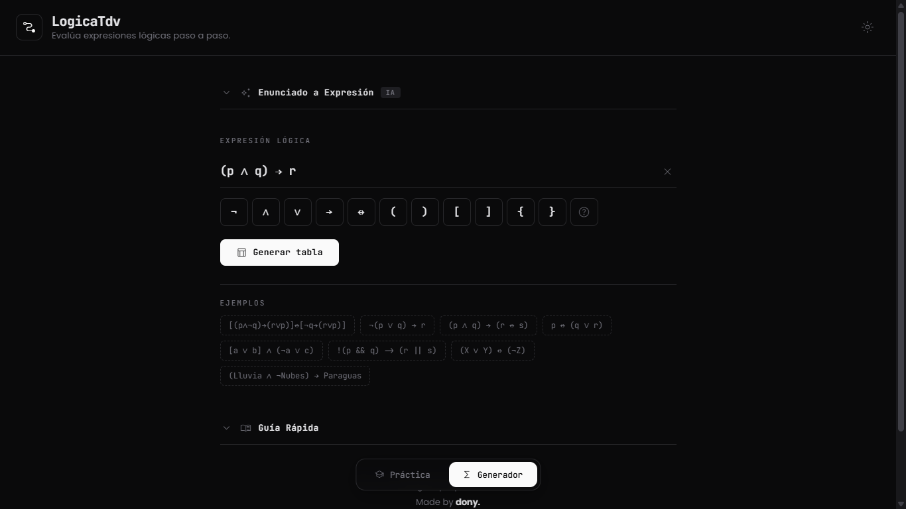

# LogicaTdv

Aplicación web para generar y practicar tablas de verdad de lógica proposicional clásica, con soporte de IA para convertir enunciados en lenguaje natural a expresiones lógicas.



## Características

- **Generador de tablas de verdad** — Ingresa cualquier expresión lógica y genera su tabla de verdad paso a paso
- **Modo práctica** — Completa celdas interactivas y recibe feedback visual (correcto/incorrecto)
- **IA: Enunciado → Expresión** — Convierte enunciados en español a expresiones lógicas usando la API de Google Gemini
- **Selector de modelos** — Elige entre Gemini 3 Flash, 2.5 Flash, 2.5 Flash-Lite, 3 Pro y 2.5 Pro (con indicadores de tier gratis/pago)
- **Tema claro/oscuro** — Toggle de tema con persistencia en localStorage
- **Responsive** — Diseño adaptado a móvil con scroll horizontal interno en tablas

## Tech Stack

- **Angular** 21.2.0
- **TypeScript** ~5.9.3
- **Google Generative AI SDK** (`@google/genai`)
- **Vercel Analytics**

## Desarrollo

### Requisitos previos

- Node.js 20+
- Angular CLI (`npm install -g @angular/cli`)

### Instalación

```bash
git clone https://github.com/dony-aep/logica-tdv.git
cd logica-tdv
npm install
```

### Servidor de desarrollo

```bash
ng serve
```

Abre `http://localhost:4200/` en tu navegador.

### Build de producción

```bash
ng build
```

Los artefactos se generan en el directorio `dist/`.

## Estructura del proyecto

```
src/app/
├── components/
│   ├── header/                  # Header con marca y toggle de tema
│   ├── footer/                  # Footer editorial
│   ├── mode-selector/           # Navegación entre modos (Práctica / Generador)
│   ├── truth-table-generator/   # Generador de tablas de verdad + IA
│   └── practice-table/          # Modo práctica interactivo
├── services/
│   ├── truth-table.service.ts   # Lógica de evaluación de expresiones
│   └── gemini.service.ts        # Integración con Google Gemini API
├── app.routes.ts                # Rutas con lazy loading
└── app.config.ts                # Configuración de la aplicación
```

## Licencia

Made by **dony**.
